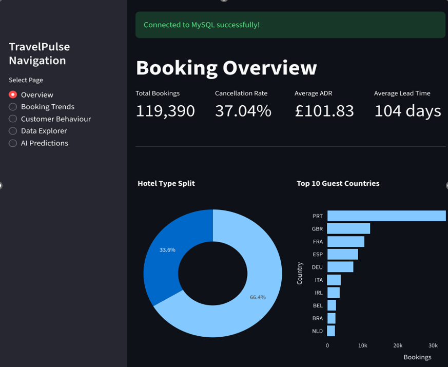
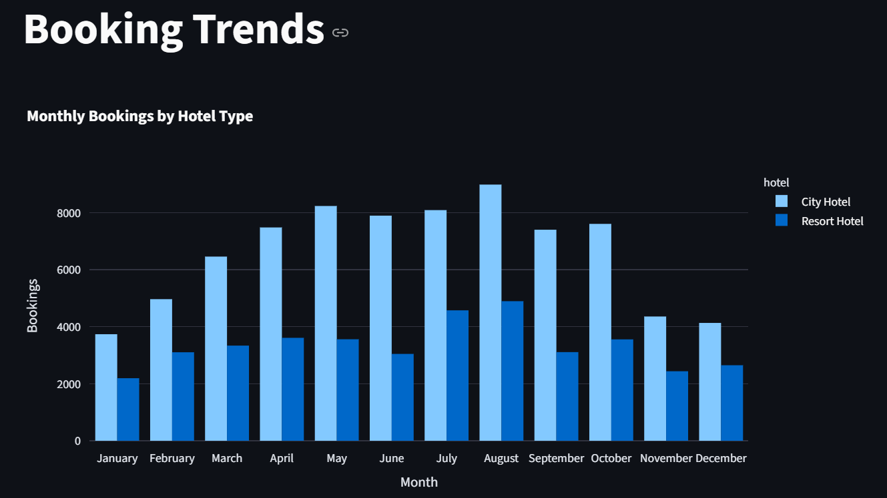
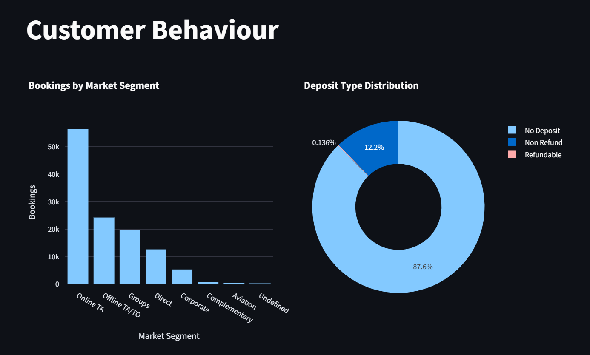
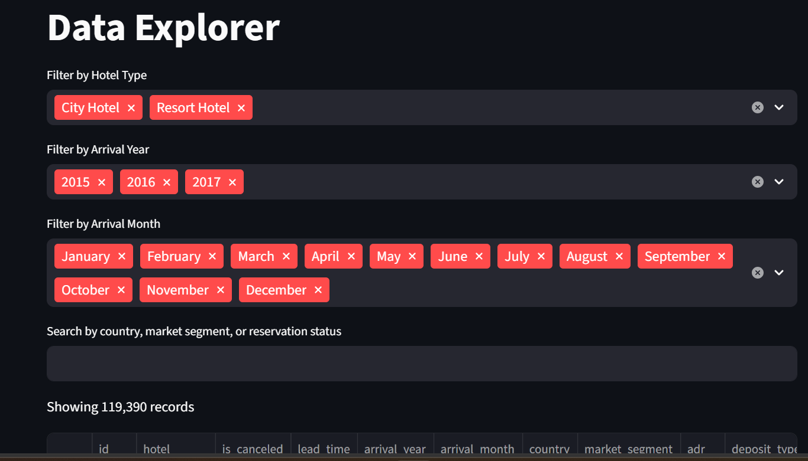
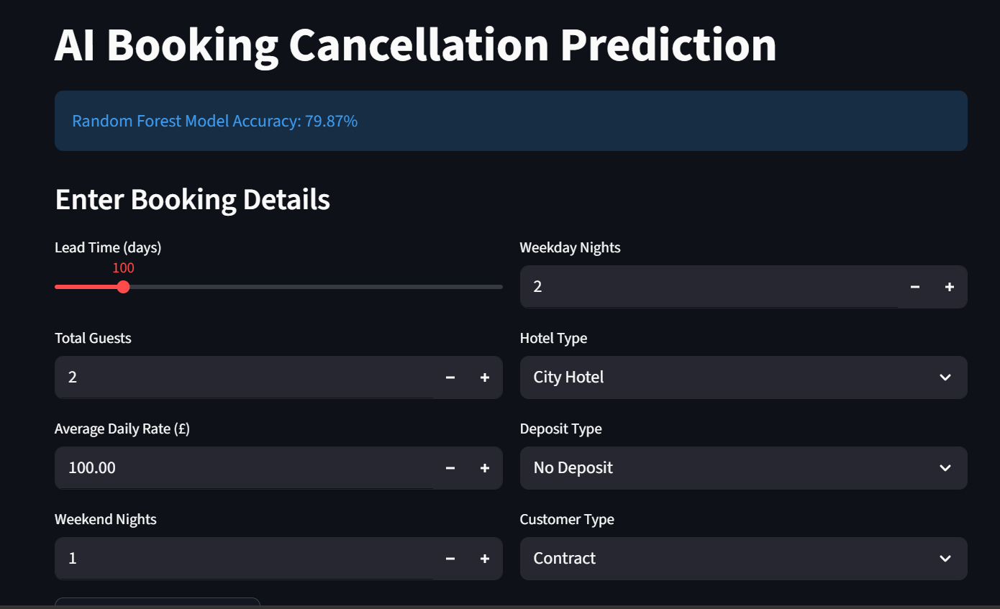
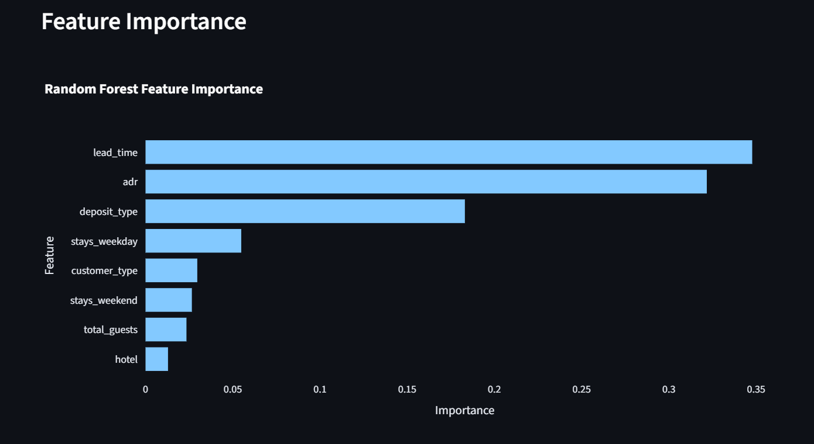
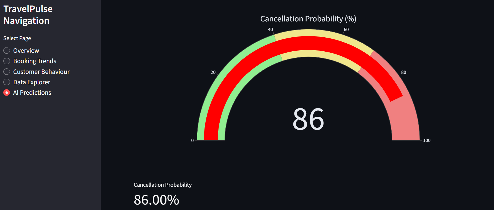
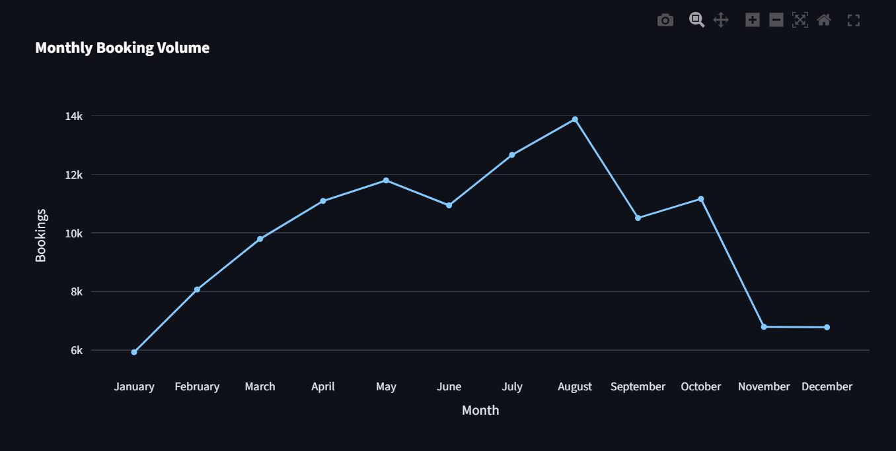
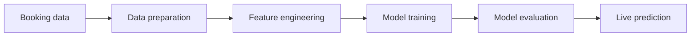

<p align="center">
  
</p>

<h2 align="center">
  AI-Powered Hotel Booking Analytics Platform
</h2>

<p align="center">
  An end-to-end data analytics and machine learning project built with Python, MySQL, Streamlit and Scikit-learn.
</p>

---

## 🛠️ Technologies

<p align="center">


</p>

---

## 📖 Project Overview

**TravelPulse** is an AI-powered hotel booking analytics platform that analyses **119,390 hotel booking records**. It helps hospitality businesses understand customer behaviour, booking patterns, seasonal demand and cancellation risk.

The project brings together data processing, SQL database integration, exploratory analysis, interactive visualisation and machine learning within a multi-page Streamlit application.

TravelPulse demonstrates the complete analytics workflow:

1. Storing and querying booking data with MySQL
2. Cleaning and preparing data with Python
3. Exploring booking and customer behaviour
4. Presenting insights through interactive dashboards
5. Training a machine learning classification model
6. Generating live booking cancellation predictions

---

## 🖥️ TravelPulse Dashboard Preview

<p align="center">
  
</p>

The dashboard preview presents the main analytical components of TravelPulse in one visual summary. It includes customer behaviour analysis, monthly booking trends, feature importance, interactive data filtering and AI-powered cancellation prediction.

---

## ✨ Key Features

- 📊 Interactive multi-page Streamlit dashboard
- 🗄️ MySQL database integration
- 📈 Booking trend and seasonal demand analysis
- 👥 Customer behaviour and market-segment analysis
- 🤖 AI-powered booking cancellation prediction
- 🎯 Machine learning feature-importance analysis
- 🔎 Interactive hotel booking data explorer
- 📥 Filtered data export functionality
- 📉 Monthly booking-volume analysis
- 📋 Model performance reporting
- 💼 Business-focused insights and recommendations

---

## 📊 Dashboard Walkthrough

### 1. Overview Dashboard

<p align="center">
  
</p>

The Overview Dashboard provides a high-level summary of the hotel booking dataset. Its key performance indicators allow users to quickly understand the size of the dataset, booking activity and cancellation behaviour.

The charts provide an accessible starting point for the analysis by presenting important booking patterns before the user explores the more detailed pages. This page is designed for managers and other stakeholders who need a concise summary of overall booking performance.

---

### 2. Booking Trends

<p align="center">
  
</p>

The Booking Trends dashboard examines how booking demand changes throughout the year. The monthly booking chart compares the number of bookings made for **City Hotels** and **Resort Hotels**, making differences between the two hotel categories visible.

The visualisation highlights seasonal increases and decreases in demand. These insights could help hotel managers plan staffing levels, marketing campaigns, room availability and pricing strategies during busy and quieter periods.

---

### 3. Customer Behaviour

<p align="center">
  
</p>

The Customer Behaviour dashboard explores how customers make their hotel reservations. The market-segment chart compares bookings generated through channels such as online travel agents, offline travel agents, direct bookings, groups and corporate customers.

The deposit-type chart shows the proportion of bookings made with no deposit, refundable deposits and non-refundable deposits. This is important because deposit behaviour can be associated with different levels of customer commitment and cancellation risk.

Together, these charts help identify the customer groups and booking channels contributing the greatest volume of reservations.

---

### 4. Data Explorer

<p align="center">
  
</p>

The Data Explorer allows users to investigate individual booking records without writing Python or SQL code. Users can filter the dataset by hotel type, arrival year, arrival month and other booking characteristics.

A search function provides additional flexibility when examining countries, market segments and reservation statuses. The filtered results can be reviewed directly in the application and exported for further analysis.

This feature makes the underlying data accessible to both technical and non-technical users.

---

### 5. AI Cancellation Prediction

<p align="center">
  
</p>

The AI Prediction dashboard uses a trained **Random Forest Classifier** to estimate whether a hotel booking is likely to be cancelled. Users enter relevant booking information, and the model generates a cancellation prediction based on the selected values.

The prediction probability is displayed through a visual gauge, making the result easy to interpret. A higher percentage indicates that the booking characteristics are associated with a greater cancellation risk.

This functionality demonstrates how machine learning can support proactive decision-making in hotel operations.

---

### 6. Feature Importance

<p align="center">
  
</p>

The Feature Importance chart explains which variables have the greatest influence on the Random Forest model’s predictions. Features with longer bars contribute more strongly to the model’s cancellation decisions.

In this analysis, factors such as **lead time**, **average daily rate**, **deposit type**, **previous cancellations** and **customer type** contribute to the prediction process. Understanding these factors makes the model more transparent and provides useful business insight into cancellation behaviour.

For example, a long lead time may give customers more opportunity to change their plans before their arrival date.

---

### 7. Model Performance

<p align="center">
  
</p>

The Model Performance dashboard evaluates how effectively the trained model predicts hotel booking cancellations. It presents classification results using appropriate performance measures and visual evaluation tools.

The model achieved an overall prediction accuracy of **79.87%** on the test data. However, accuracy should be considered alongside the model’s ability to correctly identify both cancelled and non-cancelled bookings.

This evaluation helps determine whether the model is reliable enough to provide meaningful decision support.

---

### 8. Monthly Booking Trends

<p align="center">
  
</p>

The Monthly Booking Volume chart presents the total number of bookings recorded during each month. The line makes changes in demand easy to follow and highlights periods of growth, peak activity and declining booking volume.

The trend indicates stronger demand during the summer period, followed by a reduction later in the year. Hotels could use this information to support seasonal planning, promotional activity and resource allocation.

This visual complements the hotel-type comparison by showing the combined monthly booking pattern across the dataset.

---

## 🤖 Machine Learning

TravelPulse uses a **Random Forest Classifier** to predict whether a hotel reservation is likely to be cancelled.

| Metric | Value |
|---|---:|
| Algorithm | Random Forest Classifier |
| Dataset | 119,390 hotel bookings |
| Target variable | `is_canceled` |
| Train/test split | 80/20 |
| Test accuracy | **79.87%** |
| Feature importance | Included |
| Live prediction | Included |

### Prediction Workflow



The model learns patterns from historical booking information. Once trained, it can process new booking characteristics and estimate whether the reservation is more likely to be completed or cancelled.

The prediction model is intended as an analytical demonstration and decision-support feature rather than an automated business decision system.

---

## 🗄️ Database

TravelPulse uses **MySQL** as its backend database for storing and retrieving hotel booking records.

The SQL component includes scripts for:

- Creating the TravelPulse database
- Creating the required tables
- Importing the hotel booking dataset
- Checking imported data
- Querying booking activity
- Analysing customer and hotel behaviour
- Producing business-focused insights

MySQL integration demonstrates how an analytics application can work with a structured relational database rather than relying exclusively on local CSV files.

---

## 🧰 Technology Stack

| Category | Technology |
|---|---|
| Programming | Python |
| Database | MySQL |
| Dashboard | Streamlit |
| Data analysis | Pandas and NumPy |
| Data visualisation | Plotly |
| Machine learning | Scikit-learn |
| Development environment | Jupyter Notebook |
| Version control | Git and GitHub |

---

## 💼 Skills Demonstrated

- Python development
- SQL querying and database integration
- Data cleaning and transformation
- Exploratory data analysis
- Machine learning classification
- Model evaluation
- Feature-importance analysis
- Interactive dashboard development
- Data visualisation
- Business intelligence
- Technical documentation
- Git and GitHub version control

---

## 📂 Project Structure

```text
TravelPulse/
│
├── app/                         # Streamlit application
├── assets/                      # Logos and visual assets
├── data/                        # Project datasets
├── docs/                        # Supporting documentation
├── models/                      # Saved machine learning models
├── notebooks/                   # Data analysis and ML notebooks
├── screenshots/                 # Dashboard screenshots
├── sql/                         # MySQL scripts
├── tests/                       # Application and model tests
│
├── README.md                    # Project documentation
├── requirements.txt             # Python dependencies
├── LICENSE                      # Project licence
├── .gitignore                   # Excluded files
└── .env.example                 # Environment variable template
```

---

## 🚀 Installation

### 1. Clone the repository

```bash
git clone https://github.com/sezay-rashid/TravelPulse.git
```

### 2. Open the project directory

```bash
cd TravelPulse
```

### 3. Install the required packages

```bash
pip install -r requirements.txt
```

### 4. Configure the database connection

Create a local `.env` file using `.env.example` as a template and enter your MySQL connection details.

```text
DB_HOST=localhost
DB_USER=your_mysql_username
DB_PASSWORD=your_mysql_password
DB_NAME=travelpulse
```

Do not commit your real `.env` file or database password to GitHub.

### 5. Run the Streamlit application

```bash
streamlit run app/main/streamlit_app.py
```

---

## 📈 Project Results

- ✅ Analysed **119,390 hotel booking records**
- ✅ Developed a **five-page Streamlit application**
- ✅ Integrated Python with a MySQL database
- ✅ Explored customer behaviour and booking trends
- ✅ Built a Random Forest cancellation model
- ✅ Achieved **79.87% prediction accuracy**
- ✅ Added live booking cancellation predictions
- ✅ Visualised machine learning feature importance
- ✅ Created an interactive data explorer
- ✅ Delivered an end-to-end analytics platform

---

## 🔮 Future Improvements

- Deploy the application to Streamlit Community Cloud
- Add Microsoft Power BI reporting
- Explore Microsoft Fabric integration
- Migrate the database to Azure SQL Database
- Containerise the application with Docker
- Add secure user authentication
- Develop a REST API
- Connect to real-time hotel booking data
- Compare additional classification algorithms
- Introduce automated model monitoring
- Improve prediction explainability

---

## 👨‍💻 Author

### Sezay Rashid

**BSc (Hons) Computing Graduate**

**Aspiring Data Analyst | Data Engineer | Python Developer**

📧 **Email:** sezay.rashid.dev@gmail.com

💼 **LinkedIn:** [linkedin.com/in/sezay-rashid-dev](https://www.linkedin.com/in/sezay-rashid-dev)

🐙 **GitHub:** [github.com/sezay-rashid](https://github.com/sezay-rashid)

---

## ⭐ Support

If you found this project interesting or useful, please consider giving the repository a ⭐ on GitHub.

Thank you for visiting **TravelPulse**.
